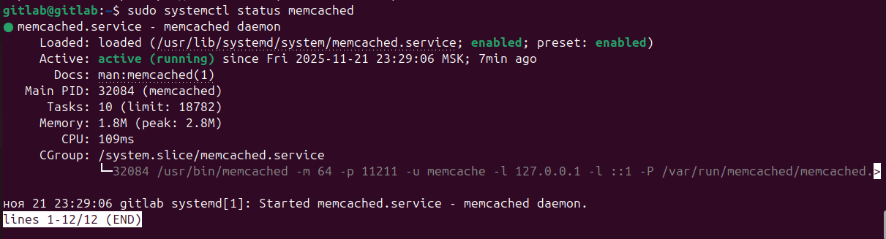
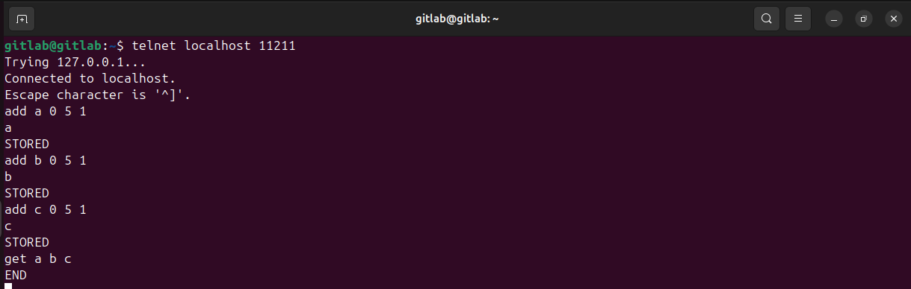
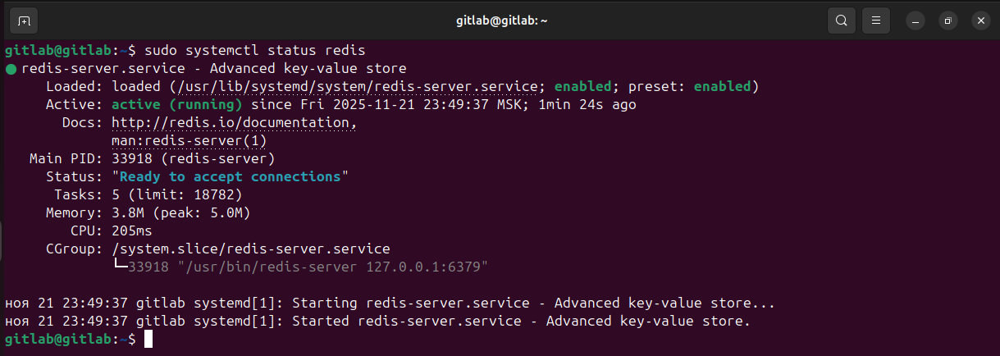
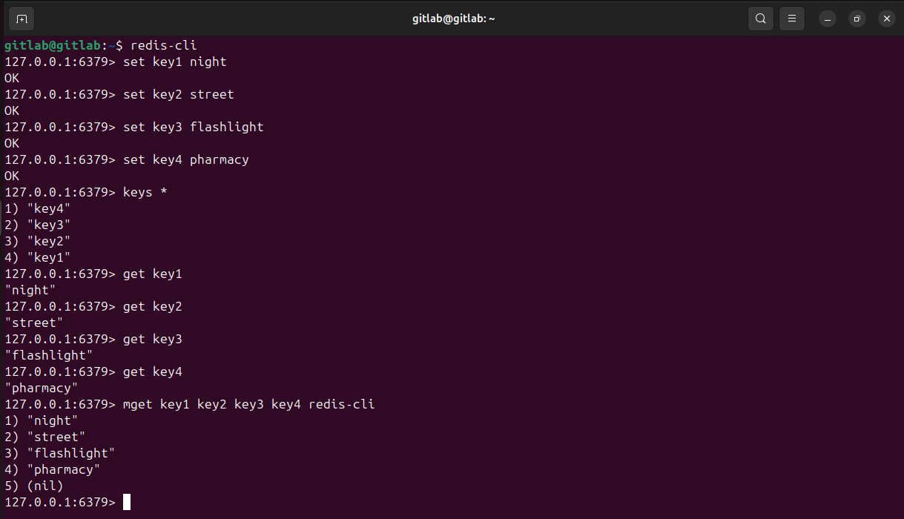

# Домашнее задание к занятию «Кеширование Redis/memcached» - 'Пшённов Николай'

## Задание 1
`Приведите примеры проблем, которые может решить кэширование. Приведите ответ в свободной форме.`

### Решение
* `Повышение производительности`
* `Увеличение скорости ответа`
* `Экономия ресурсов`
* `Сглаживание бустов трафика`

## Задание 2
`Установите и запустите memcached. Приведите скриншот systemctl status memcached, где будет видно, что memcached запущен.`

### Решение
* `Устанавливаю Memcached`
```
sudo apt install memcached
```
* `Проверяю статус`
```
sudo systemctl status memcached
```


## Задание 3
`Запишите в memcached несколько ключей с любыми именами и значениями, для которых выставлен TTL 5. Приведите скриншот, на котором видно, что спустя 5 секунд ключи удалилсь из базы.`

### Решение
* `заходим на ttl`
```
telnet localhost 11211
```
* `Вводим как указано на скриншоте`


## Задание 4
`Запись данных в Redis. Запишите в redis несколько ключей с любыми именами и значениями. Через redis-cli достаньте все записанные ключи и значения из базы, приведите скриншот этой операции.`

### Решение
* `Устанавливаю Redis`
```
sudo apt install redis
```
* `Проверяю статус`
```
sudo systemctl status redis
```

* `Заходим в Redis и выполняем команды как на скриншоте`
```
redis-cli
```


---
